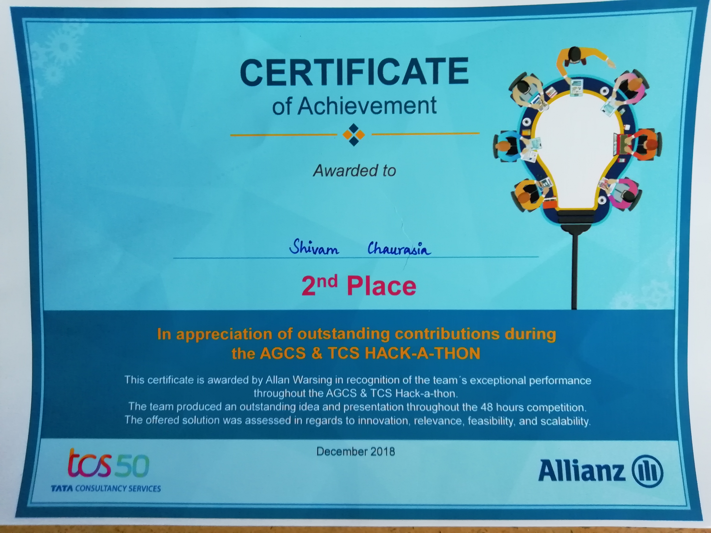

# 48 Hours Live Hackathon Winner

Challenge
------
> To develop a working prototype in one of three domains and proividing practical actional results to the Business units.

Our Team Solution
------
> We selected Productivity as our theme and developed a two phase solution for tackling the challenge. First, automated offline onboarding uses Augmented Reality and entire Online onboarding using OmniChannel Integrated Voice Over chatbot.
> Integrating all the enterprise application for onbaording like ServiceNow, IDM, Asset Location, Resource Allocation, and automating it through lambda actions.
> Whenever, a action is performed on any integration application automated Bot Calls the resource for the required action.
Ex: 
1. Bot Calls The New Resource > Collects Personal Details > Creates Ticket.
2. An IT Team work on ticket > Put in pending for user action for missing action > Bot Automatically calls the user > collects information on the call > update the ticket and make in progress again.

Rewards
------
:moneybag: INR 75000 - Runner Up Winner Rewards
:moneybag: INR 25000 - Peer Voting Winner Rewards

[AudioDemo](https://drive.google.com/open?id=1QUUCyOnn6jWIsWhqs6zSxZsHKy2DjAAD)

